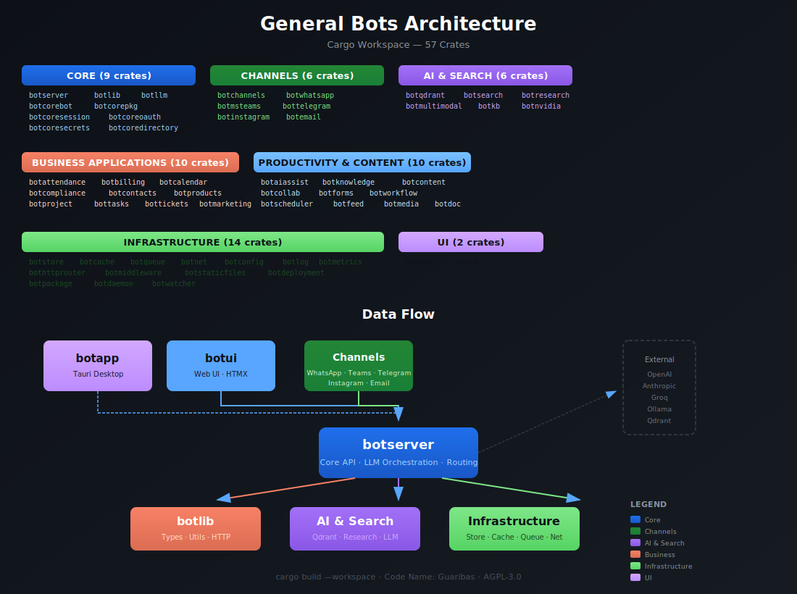
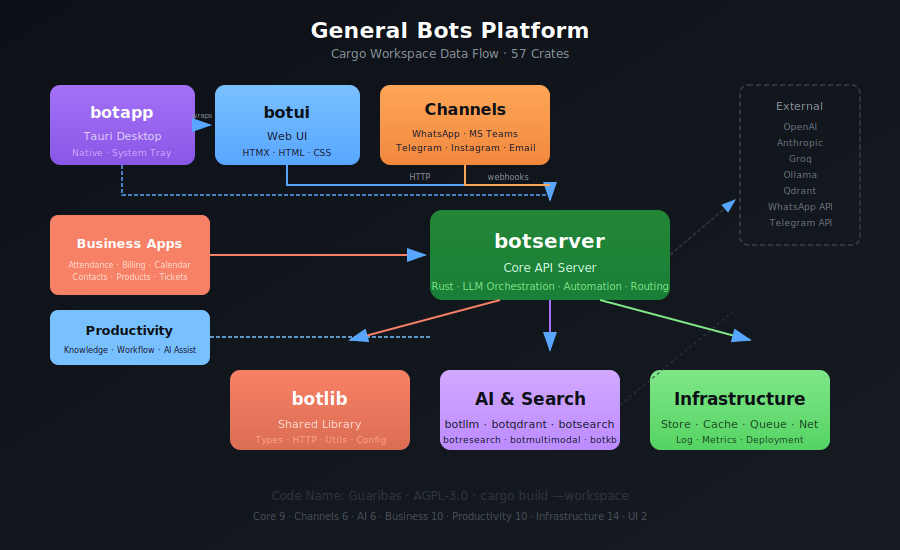

<center>

</center>


<a href="https://github.com/generalbots/generalbots/graphs/contributors">

</a>
# General Bots

**Enterprise-Grade LLM Orchestrator and AI Automation Platform**

A strongly-typed, self-hosted conversational platform built in Rust with 57 workspace crates, focused on convention over configuration and code-less approaches.

---

## Architecture



---

## Platform Data Flow



---

## Workspace Crates

The **[generalbots](https://github.com/GeneralBots/generalbots)** repository is a Cargo workspace monorepo containing 57 crates organized by layer:

### Core

| Crate | Description |
|-------|-------------|
| [**botserver**](https://github.com/GeneralBots/generalbots/tree/main/botserver) | Core API server — LLM orchestration, automation, routing |
| [**botlib**](https://github.com/GeneralBots/generalbots/tree/main/botlib) | Shared library — common types, utilities, HTTP client |
| [**botllm**](https://github.com/GeneralBots/generalbots/tree/main/botllm) | LLM provider implementations and core types |
| [**botcorebot**](https://github.com/GeneralBots/generalbots/tree/main/botcorebot) | Core bot abstractions and bot runtime |
| [**botcorepkg**](https://github.com/GeneralBots/generalbots/tree/main/botcorepkg) | Core package management |
| [**botcoresession**](https://github.com/GeneralBots/generalbots/tree/main/botcoresession) | Session management |
| [**botcoreoauth**](https://github.com/GeneralBots/generalbots/tree/main/botcoreoauth) | OAuth authentication providers |
| [**botcoresecrets**](https://github.com/GeneralBots/generalbots/tree/main/botcoresecrets) | Secrets and vault integration |
| [**botcoredirectory**](https://github.com/GeneralBots/generalbots/tree/main/botcoredirectory) | Directory services |

### Channels

| Crate | Description |
|-------|-------------|
| [**botchannels**](https://github.com/GeneralBots/generalbots/tree/main/botchannels) | Social media channel integrations |
| [**botwhatsapp**](https://github.com/GeneralBots/generalbots/tree/main/botwhatsapp) | WhatsApp Business API connector |
| [**botmsteams**](https://github.com/GeneralBots/generalbots/tree/main/botmsteams) | Microsoft Teams connector |
| [**bottelegram**](https://github.com/GeneralBots/generalbots/tree/main/bottelegram) | Telegram Bot API connector |
| [**botinstagram**](https://github.com/GeneralBots/generalbots/tree/main/botinstagram) | Instagram messaging connector |
| [**botemail**](https://github.com/GeneralBots/generalbots/tree/main/botemail) | Email channel integration |

### AI & Search

| Crate | Description |
|-------|-------------|
| [**botqdrant**](https://github.com/GeneralBots/generalbots/tree/main/botqdrant) | Qdrant vector database client |
| [**botsearch**](https://github.com/GeneralBots/generalbots/tree/main/botsearch) | Full-text search service |
| [**botresearch**](https://github.com/GeneralBots/generalbots/tree/main/botresearch) | Web search, knowledge base exploration, deep research |
| [**botmultimodal**](https://github.com/GeneralBots/generalbots/tree/main/botmultimodal) | Multimodal AI client — image, video, audio, speech |
| [**botkb**](https://github.com/GeneralBots/generalbots/tree/main/botkb) | Face recognition and computer vision models |
| [**botnvidia**](https://github.com/GeneralBots/generalbots/tree/main/botnvidia) | NVIDIA GPU monitoring module |

### Business Applications

| Crate | Description |
|-------|-------------|
| [**botattendance**](https://github.com/GeneralBots/generalbots/tree/main/botattendance) | Attendance — queue, SLA, webhooks, LLM assist |
| [**botbilling**](https://github.com/GeneralBots/generalbots/tree/main/botbilling) | Billing, invoicing, quotas, subscription management |
| [**botcalendar**](https://github.com/GeneralBots/generalbots/tree/main/botcalendar) | Calendar and scheduling |
| [**botcompliance**](https://github.com/GeneralBots/generalbots/tree/main/botcompliance) | Compliance and regulatory tracking |
| [**botcontacts**](https://github.com/GeneralBots/generalbots/tree/main/botcontacts) | Contact and CRM management |
| [**botproducts**](https://github.com/GeneralBots/generalbots/tree/main/botproducts) | Products, services, inventory, pricing |
| [**botproject**](https://github.com/GeneralBots/generalbots/tree/main/botproject) | Project management |
| [**bottasks**](https://github.com/GeneralBots/generalbots/tree/main/bottasks) | Task management |
| [**bottickets**](https://github.com/GeneralBots/generalbots/tree/main/bottickets) | Ticket and helpdesk system |
| [**botmarketing**](https://github.com/GeneralBots/generalbots/tree/main/botmarketing) | Marketing campaigns, email, WhatsApp, IP routing |
| [**botsocial**](https://github.com/GeneralBots/generalbots/tree/main/botsocial) | Social media management |
| [**botpeople**](https://github.com/GeneralBots/generalbots/tree/main/botpeople) | People and HR management |
| [**botlearn**](https://github.com/GeneralBots/generalbots/tree/main/botlearn) | Learning Management System (LMS) |
| [**botlegal**](https://github.com/GeneralBots/generalbots/tree/main/botlegal) | Legal document management |
| [**botsecurity**](https://github.com/GeneralBots/generalbots/tree/main/botsecurity) | Security infrastructure |

### Productivity & Content

| Crate | Description |
|-------|-------------|
| [**botdocs**](https://github.com/GeneralBots/generalbots/tree/main/botdocs) | Document processing, collaboration, conversion |
| [**botsheet**](https://github.com/GeneralBots/generalbots/tree/main/botsheet) | Spreadsheet processing |
| [**botslides**](https://github.com/GeneralBots/generalbots/tree/main/botslides) | Presentation and slides |
| [**botpaper**](https://github.com/GeneralBots/generalbots/tree/main/botpaper) | Paper and report generation |
| [**botplayer**](https://github.com/GeneralBots/generalbots/tree/main/botplayer) | Media player |
| [**botvideo**](https://github.com/GeneralBots/generalbots/tree/main/botvideo) | Video processing and meetings |
| [**botcanvas**](https://github.com/GeneralBots/generalbots/tree/main/botcanvas) | Canvas and drawing |
| [**botdesigner**](https://github.com/GeneralBots/generalbots/tree/main/botdesigner) | Visual designer |
| [**botweba**](https://github.com/GeneralBots/generalbots/tree/main/botweba) | Web application builder |

### Infrastructure

| Crate | Description |
|-------|-------------|
| [**botdeployment**](https://github.com/GeneralBots/generalbots/tree/main/botdeployment) | Deployment infrastructure for VibeCode platform |
| [**botmonitoring**](https://github.com/GeneralBots/generalbots/tree/main/botmonitoring) | Monitoring, metrics, alerting, distributed tracing |
| [**bottimeseries**](https://github.com/GeneralBots/generalbots/tree/main/bottimeseries) | Time-series metrics service (InfluxDB-compatible) |
| [**botmaintenance**](https://github.com/GeneralBots/generalbots/tree/main/botmaintenance) | System maintenance and cleanup |
| [**botbrowser**](https://github.com/GeneralBots/generalbots/tree/main/botbrowser) | Browser automation |
| [**botsources**](https://github.com/GeneralBots/generalbots/tree/main/botsources) | Source code management |
| [**botautotask**](https://github.com/GeneralBots/generalbots/tree/main/botautotask) | Automated task execution |
| [**botdashboards**](https://github.com/GeneralBots/generalbots/tree/main/botdashboards) | Dashboard and visualization |
| [**botworkspaces**](https://github.com/GeneralBots/generalbots/tree/main/botworkspaces) | Workspace management |

### UI

| Crate | Description |
|-------|-------------|
| [**botui**](https://github.com/GeneralBots/generalbots/tree/main/botui) | Pure web interface — HTMX-based |
| [**botapp**](https://github.com/GeneralBots/generalbots/tree/main/botapp) | Tauri desktop wrapper — native file access |

### Non-Workspace Directories

| Directory | Description |
|-----------|-------------|
| [**botanalytics**](https://github.com/GeneralBots/generalbots/tree/main/botanalytics) | Analytics, insights, OKR goals tracking |
| [**botattendant**](https://github.com/GeneralBots/generalbots/tree/main/botattendant) | Contact center attendant queue and agent management |
| [**botbook**](https://github.com/GeneralBots/generalbots/tree/main/botbook) | Documentation — mdBook format |
| [**botdevice**](https://github.com/GeneralBots/generalbots/tree/main/botdevice) | Android, HarmonyOS, and IoT device integration |
| [**botmodels**](https://github.com/GeneralBots/generalbots/tree/main/botmodels) | AI model storage and management |
| [**botplugin**](https://github.com/GeneralBots/generalbots/tree/main/botplugin) | Plugin system |
| [**bottemplates**](https://github.com/GeneralBots/generalbots/tree/main/bottemplates) | Bot, app, and prompt templates |
| [**bottest**](https://github.com/GeneralBots/generalbots/tree/main/bottest) | Integration and E2E test suite |

---

## Organization Repositories

| Repository | Description | Language |
|------------|-------------|----------|
| [**generalbots**](https://github.com/GeneralBots/generalbots) | Core monorepo — 57 workspace crates, LLM orchestration | Rust |
| [**botcoder**](https://github.com/GeneralBots/botcoder) | LLM code generator — AI-assisted coding | Rust |
| [**helicoder**](https://github.com/GeneralBots/helicoder) | VR coding environment — Bevy-based 3D code editor | Rust |
| [**magazine**](https://github.com/GeneralBots/magazine) | General Bots Magazine editions | — |
| [**website**](https://github.com/GeneralBots/website) | General Bots website — generalbots.org | TypeScript |
| [**.github**](https://github.com/GeneralBots/.github) | Organization profile and config | — |

---

## Quick Start

### Clone & Build

```bash
git clone https://github.com/GeneralBots/generalbots.git
cd generalbots
cargo build
```

### Run

```bash
cargo run --bin botserver
```

---

## Key Features

| Feature | Description |
|---------|-------------|
| Multi-Vendor LLM | Unified API for OpenAI, Groq, Claude, Anthropic, Azure |
| MCP and Tools | Instant tool creation from code and functions |
| Semantic Cache | 70% cost reduction on LLM calls |
| Web Automation | Browser automation with AI intelligence |
| Enterprise Connectors | CRM, ERP, database integrations |
| Version Control | Git-like history with rollback |
| Omichannel | WhatsApp, Teams, Telegram, Instagram, Email, Web |
| Vector Search | Qdrant-powered RAG and semantic retrieval |
| VR Coding | Helicoder — Bevy-based 3D development environment |

---

## Documentation

- [Complete Docs](https://github.com/GeneralBots/generalbots/tree/main/botbook)
- [API Reference](https://github.com/GeneralBots/generalbots/tree/main/botserver/docs)
- [Website](https://generalbots.org)

---

## License

**AGPL-3.0** — True open source with dual licensing option.

---

Code Name: Guaribas
